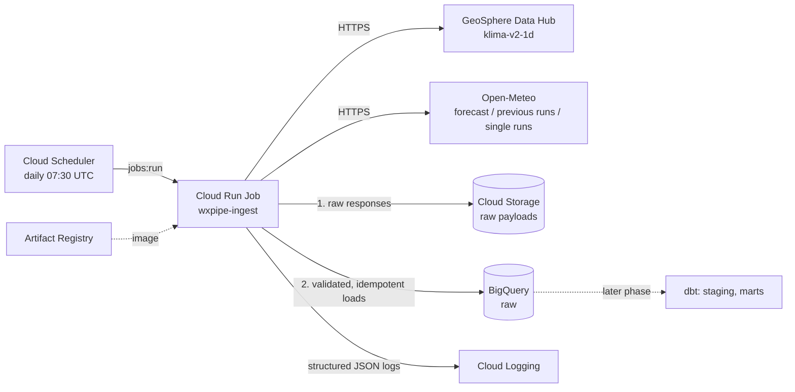

# weather-forecast-checker

An extract-and-load backend that collects daily weather **observations** and
weather **forecasts** for Salzburg Airport into BigQuery, so that forecast
skill can later be measured against what actually happened, by lead time.

- Observations: [GeoSphere Austria Data Hub](https://data.hub.geosphere.at/),
  daily climate station data (`klima-v2-1d`, station 6300 Salzburg Flughafen).
- Forecasts: [Open-Meteo](https://open-meteo.com/), GeoSphere's seamless model
  (AROME Austria continued with ECMWF IFS), from three APIs: the current
  forecast, archived forecasts at fixed lead times of 1 to 7 days, and complete
  individual model runs.

The code is the R package `wxpipe`, shipped as a container and run once a day
as a Cloud Run Job. This repository is the ingestion layer only; dbt
transformations and a serving API are later phases.

## Architecture



Each run, per source:

1. **Fetch** everything planned for the day (or backfill range), throttled to
   the APIs' rate limits, retrying transient failures with backoff.
2. **Land** every unmodified response in Cloud Storage before parsing, so a
   parsing bug can be fixed and replayed without calling the APIs again.
3. **Parse** with pure functions into long-format rows, validate them against
   the table schema, and **load** them idempotently: a re-run never duplicates
   rows, and forecasts are never overwritten by newer forecasts.

The reasoning behind these choices is in the
[architecture decision records](docs/adr/README.md); every table and column is
described in the [data dictionary](docs/data-dictionary.md), which is generated
from `inst/schemas/`.

## Repository layout

| Path | Contents |
|---|---|
| `R/` | Package code: API clients, parsers, schema validation, GCS landing, BigQuery loads, CLI, logging |
| `exec/ingest.R` | Command-line entrypoint of the job |
| `inst/config/sources.yml` | Locations, station, dataset, variables, rate limits, archive dates |
| `inst/schemas/` | Table schemas: the single source of truth for loads, Terraform tables and the data dictionary |
| `tests/testthat/` | Offline unit tests with recorded API responses |
| `tests/integration/` | Opt-in tests against a real BigQuery sandbox dataset |
| `terraform/` | Infrastructure; see [terraform/README.md](terraform/README.md) |
| `docs/` | Data dictionary and ADRs |
| `scripts/` | Local check script and data dictionary generator |

## Local development

Requirements: R 4.5.3 (the version pinned in `renv.lock` and the container).
On Windows, installing packages from Posit Package Manager binaries needs no
Rtools.

Restore the pinned packages (renv activates automatically in the project):

```bash
Rscript -e "renv::restore()"
```

Run everything CI runs (lintr, styler, roxygen2, tests, R CMD check):

```bash
Rscript scripts/check.R
```

Tests run fully offline: API responses are replayed from
`tests/testthat/fixtures/` (httptest2), retries are exercised against a local
webfakes server, and BigQuery is replaced by an in-memory stand-in. A missing
fixture directory is an error rather than a silent live call. To re-record,
run a client's test file with `WXPIPE_RECORD_FIXTURES=true`; this calls the
live APIs and replaces that file's fixture directories.

### Running the pipeline locally

Install the package, then run the entrypoint. A dry run fetches, parses and
validates, but writes nothing and needs no Google Cloud access:

```bash
Rscript -e "install.packages('.', repos = NULL, type = 'source')"
```

```bash
Rscript exec/ingest.R --dry-run
```

To write to Google Cloud, authenticate with Application Default Credentials
and set the target through environment variables (there are no defaults):

```bash
gcloud auth application-default login
```

| Variable | Meaning |
|---|---|
| `WXPIPE_GCP_PROJECT` | Project that owns the dataset and pays for queries |
| `WXPIPE_BQ_DATASET` | Dataset with the raw tables, e.g. `raw` |
| `WXPIPE_GCS_BUCKET` | Raw payload bucket |

```bash
Rscript exec/ingest.R --source=all --mode=daily
```

### Command line

```
Rscript exec/ingest.R --source=geosphere|openmeteo|all \
                      --mode=daily|backfill \
                      --start-date=YYYY-MM-DD --end-date=YYYY-MM-DD \
                      --location=salzburg-airport \
                      --dry-run
```

- **daily** (default): GeoSphere's last 14 days up to yesterday (observations
  are revised after first publication), the current Open-Meteo forecast, and
  yesterday's archived lead times and model runs.
- **backfill**: the given UTC date range, both ends inclusive.
- Without `--location`, every configured location is ingested.
- Exit status: 0 success, 1 a source failed (the other sources still ran),
  2 invalid usage or configuration.

### Backfills

Backfills are idempotent, so a range can be re-run safely. Mind the source
archives and the Open-Meteo call budget:

- GeoSphere station 6300 reaches back to 1939. A long range is split into
  requests automatically.
- Open-Meteo Previous Runs data starts on 2024-02-04; a range starting
  earlier is refused.
- Open-Meteo Single Runs start on 2026-04-02; earlier model runs are skipped
  with a warning.
- Every run checks its planned Open-Meteo cost against `daily_call_budget`
  (2,000 calls; the free tier allows 10,000 per day) before sending anything.
  About four months of Open-Meteo history fit comfortably in one execution.

```bash
Rscript exec/ingest.R --source=geosphere --mode=backfill --start-date=2000-01-01 --end-date=2026-09-13
```

```bash
Rscript exec/ingest.R --source=openmeteo --mode=backfill --start-date=2024-02-04 --end-date=2024-05-31
```

On Google Cloud, the same arguments are passed to the job, see
[terraform/README.md](terraform/README.md#operating).

### Integration tests

Integration tests load into a real BigQuery dataset whose name must contain
`sandbox`, and run only when explicitly enabled:

```bash
WXPIPE_INTEGRATION_TESTS=true WXPIPE_GCP_PROJECT=your-project WXPIPE_BQ_SANDBOX_DATASET=wxpipe_sandbox Rscript -e "devtools::load_all(); testthat::test_dir('tests/integration')"
```

### Documentation

After changing a schema in `inst/schemas/`, regenerate the data dictionary
(CI fails if it is out of date):

```bash
Rscript scripts/generate_data_dictionary.R
```

## Continuous integration

| Workflow | Runs | On |
|---|---|---|
| `lint` | lintr, styler, data dictionary up to date | every push and pull request |
| `R-CMD-check` | R CMD check against current CRAN | every push and pull request |
| `test-coverage` | tests and covr coverage against `renv.lock` | every push and pull request |
| `docker` | image build; push to Artifact Registry | pull requests (build) and `main` (push) |
| `terraform` | fmt, validate; read-only plan | infrastructure changes |

Deployment is manual (`terraform apply`).

## Costs

Estimated for one location, daily runs, in `europe-west3`. Free tiers apply
per billing account, prices change, and the figures below are estimates from
measured request and row volumes, so check the
[pricing calculator](https://cloud.google.com/products/calculator) for your
situation.

| Service | Usage | Expectation |
|---|---|---|
| Cloud Run Jobs | About 1-2 minutes per day at 1 vCPU and 1 GiB, roughly 3,600 vCPU-seconds per month | Within the free tier of 240,000 vCPU-seconds and 450,000 GiB-seconds per month |
| BigQuery storage | About 17,000 forecast rows per day, a few GB in the first year including backfills | Within the free 10 GiB per month for the first years |
| BigQuery queries | The load transactions scan little data; loading itself is free | Within the free 1 TiB of queries per month |
| Cloud Storage | Well under 1 MB of compressed raw payloads per day | A few cents at most; Always Free does not cover European regions |
| Artifact Registry | Up to 10 images of roughly a gigabyte, with shared layers | About $0.10 per GiB-month above the free 0.5 GiB |
| Cloud Scheduler | One job | Free (3 jobs per billing account per month) |

Expected total: well under 1 USD per month, mostly container image storage.

The APIs are free: GeoSphere needs no key, and Open-Meteo's free tier is for
non-commercial use up to 10,000 calls per day. A daily run uses about 11 calls
(fractional counting for requests with many variables).

## Data sources and licences

Both sources are licensed under
[Creative Commons Attribution 4.0 International (CC BY 4.0)](https://creativecommons.org/licenses/by/4.0/).
Values are stored unmodified; derived data (for example daily aggregates in a
later phase) must say that it was changed.

**GeoSphere Austria.** Observations from the dataset
"Stationsdaten-v2 (1 d): Qualitätsgeprüfte Stationsdaten für Österreich in
täglicher Auflösung", published by GeoSphere Austria,
[doi:10.60669/gs6w-jd70](https://doi.org/10.60669/gs6w-jd70), via the
[GeoSphere Data Hub](https://data.hub.geosphere.at/dataset/klima-v2-1d).
Note that the dataset is CC BY 4.0, which requires attribution; it is not
public domain (CC0).

**Open-Meteo.** Forecast data by [Open-Meteo.com](https://open-meteo.com/),
which combines output from national weather services, here GeoSphere Austria
(AROME) and ECMWF. Open-Meteo asks for a link wherever its data is shown:
`<a href="https://open-meteo.com/">Weather data by Open-Meteo.com</a>`. Its
free API is for non-commercial use only; see the
[terms](https://open-meteo.com/en/terms) and
[licence](https://open-meteo.com/en/licence).

## Open questions

- The aggregation period of Open-Meteo's hourly `sunshine_duration` is not
  stated in its hourly documentation (recorded responses are consistent with
  the hour ending at the valid time). Confirm before comparing with
  GeoSphere's `so_h`.
- GeoSphere's metadata does not state whether `p_mittel` is station-level or
  reduced pressure, which matters when comparing it with Open-Meteo's
  `surface_pressure`.

## Licence

The code is released under the MIT licence (see `LICENSE.md`). The data it
collects remains under its sources' licences above.
